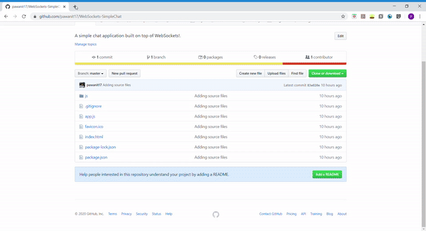

# Lets Chat
'Lets Chat' is a simple WebSockets chat application that gives 'Game Of Thrones' dialogues as its respones. This project is about establishing a simple
communication channel between the client and the server using WebSockets API and exchange information.

## Introduction 
In this case, I used NodeJS for the backend with HTML, JS and Bootstrap 4 for the front end. I have used the NodeJS module 'ws' for leveraging the
server sockets and have used the WebSocket API for client socket. I visit the web page and start some random conversation with it. All the chat
exchange is captured in a TextArea on the same page.

## Project set up
- Download NodeJS from https://nodejs.org/en/download/
- Download VS Code from https://code.visualstudio.com/download
- Install 'ws' NodeJS module ( refer to documentation here: https://www.npmjs.com/package/ws ) using the below command
   ```bash
   npm install ws
   ```
- Documentation and usage of native JavaScript WebScoket can be found here: https://developer.mozilla.org/en-US/docs/Web/API/WebSocket
 
## Developing the Chat application
The following steps are the main steps invovled in the development of this application.

### Backend Configuration
We now discuss the server configuration needed to establish a communication back end.

#### Creating a NodeJS HTTP server
We use the 'http' module of NodeJS to spawn a server. This listens to 8000 in the current implementation.
   ```bash
const server = http.createServer( (req, res)=>{
...
}
   ```

#### Creating the WebSocket Server
We then use the 'ws' module to create a WebSocket server which listens to the HTTP traffic to see if there is any 'ws' traffic. If so, an
HTTP 101 would take place to upgrade the HTTP to WS traffic.
   ```bash
const wss = new websocket.Server({ server } )
   ```
   
#### Events & sending/receiving information to/from client
- Whenever a client attempts to make a connection to the server using 'ws' protocol and if the connection succeeds, then the event 'connection'
would be emitted/fired on the above instantiated 'wss' object.
- The incomming 'socket' object in the callback is the actual web socket to which the server
has to write to send information to the client that is now connected. This can be done via the 'send' method as shown below.
- Whenever a new message comes up from the client, the 'socket' object would be notified via the 'message' event. The message can be identified
with the help of the incoming 'data' object to the callback.

        // A 'connection' event indicates that a client has connected to it
        // and the communication with the client can be achieved with the
        // incoming 'socket' object to the callback.
        wss.on('connection', (socket, request)=>{
            console.log('Server: WebScoket request accepted');
            
            // Sending a message to the client through the created socket.
            socket.send( 'Welcome to the chat!.' );
        
            // Message is an event that is emitted on the Socket object
            // whenever there is a message from the client.
            socket.on('message', (data)=>{
                console.log('Received from the client' + data);
        
                // Get a random number between 0 and 40 and send the correspnding entry from
                // 'gameOfThronesDialogs' array created above.
                socket.send( gameOfThronesDialogs[Math.floor((Math.random() * 39) + 1)] );
            })
        })

#### Server responses
Since we are building an app where the server responds to the incoming messges with quotes from 'Game of Thrones', we use an array 'gameOfThronesDialogs'
to hold a collection of 40 such quotes and we use a random number from 0 to 39 to retrieve on among these as a response to the user's input.

    var gameOfThronesDialogs = [
        "The man who passes the sentence should swing the sword. — Ned Stark",
        "The things I do for love. — Jaime Lannister",
        "I have a tender spot in my heart for cripples, bastards and broken things. — Tyrion",
        ...
    ]

    socket.send( gameOfThronesDialogs[Math.floor((Math.random() * 39) + 1)] );

### Frontend Configuration
We now discuss the client configuration needed to establish a communication to the server and also the UI of the application.

#### Connecting to the server

We use the native JavaScript WebSockets API for making the connection to the server. This is done by creating an instance of the WebSocket
passing on the URL as shown below. Also, this is an excellent read on the same topic: https://developer.mozilla.org/en-US/docs/Web/API/WebSocket/WebSocket 
   ```bash
let ws = new WebSocket("ws://localhost:8000");
   ```

#### Events & sending/receiving information to/from server
- When the client is successfully able to make a connection with the server, the following callback on the 'onopen' property would be
invoked.

        ws.onopen = function(event) {
            console.log("Client: WebSocket request accepted.");
        };

- When the client receives a message from the server, it can be retrieved via the 'onmessage' property as shown below.

        ws.onmessage = function(event) {
            console.log("Received from the server" + event.data);
        }

- When the client needs to send a message to the server, it can use the 'send' method on the WebSocket object as shown below.

        ws.send( $("#inputMessageTextBox").val() );

#### Developing the UI
The UI is built with HTML + Bootstrap 4 boiler starter template available at Bootstrap 4 website and by adding the form controls by visiting 
those appropriate sections in the Bootstrap 4 website.
- Bootstrap starter template: https://getbootstrap.com/docs/4.4/getting-started/introduction/#starter-template
- Bootstrap Form controls: https://getbootstrap.com/docs/4.4/components/forms/#form-controls

## Preview of the project
An overview of the automation that is accomplished by this script can be found below. I used 'Game Bar' recorder of Windows 10 for this
recording ( which I eventually turned to a GIF online ).


